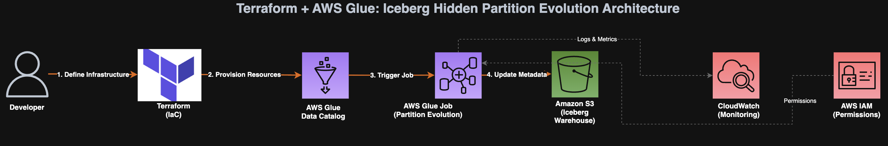
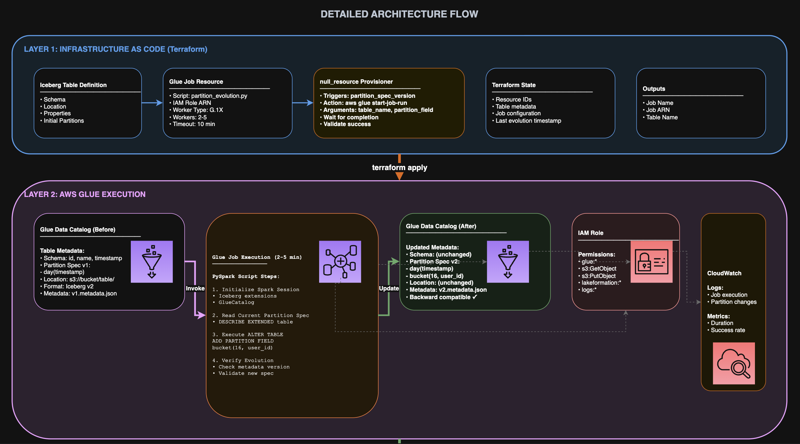
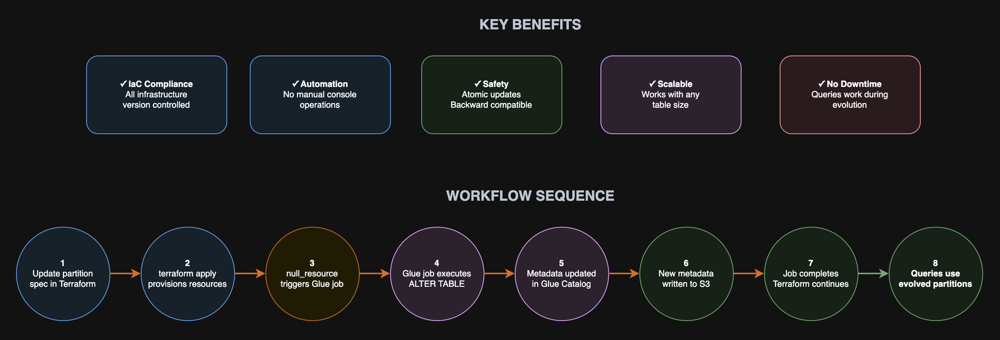

# Iceberg Hidden Partitioning for AWS Glue Tables

Infrastructure as Code (IaC) solution for managing Apache Iceberg tables in AWS Glue with automated hidden partition support. This Terraform module enables declarative configuration of Iceberg table partitioning using time-based transforms (day, month, year) without manual DDL operations.

> **Note**: This README describes the intended architecture where temporary Glue jobs are created, executed, and deleted during Terraform apply. The current implementation requires a pre-existing Glue job. See the [Implementation Status](#implementation-status) section for details.

## Overview

Apache Iceberg supports hidden partitioning, which allows you to partition data based on transformations of column values without exposing partition columns to users. This module automates the creation and management of Iceberg tables with hidden partitions in AWS Glue.

The solution uses a unique approach: when you run `terraform apply`, the module detects Iceberg tables that need partition transforms and triggers a Python orchestration script. This script dynamically creates a temporary AWS Glue job, executes it to apply the partition transforms using Spark SQL, waits for completion, and then deletes the temporary job - all within a single Terraform deployment.

### Workflow Summary

```
┌──────────────────────────────────────────────────────────────────┐
│                      terraform apply                             │
└────────────────────────────┬─────────────────────────────────────┘
                             │
                             ▼
┌──────────────────────────────────────────────────────────────────┐
│  Glue-DB-Module: Creates database & tables from YAML            │
└────────────────────────────┬─────────────────────────────────────┘
                             │
                             ▼
┌──────────────────────────────────────────────────────────────────┐
│  Detects tables with partition_transforms in locals.tf          │
└────────────────────────────┬─────────────────────────────────────┘
                             │
                             ▼
┌──────────────────────────────────────────────────────────────────┐
│  terraform_data resource triggers local-exec provisioner        │
└────────────────────────────┬─────────────────────────────────────┘
                             │
                             ▼
┌──────────────────────────────────────────────────────────────────┐
│  Python Orchestrator (iceberg_hidden_partition.py)              │
│  ┌────────────────────────────────────────────────────────────┐ │
│  │ 1. Query Athena: SHOW CREATE TABLE                        │ │
│  │ 2. Parse current partition state from DDL                 │ │
│  │ 3. Compare: current_partitions == desired_partitions?     │ │
│  │ 4. If different:                                          │ │
│  │    - Create temp Glue job (iceberg-partition-<db>)       │ │
│  │    - Upload partition.py to S3                           │ │
│  │    - Start job with --partitions-json argument           │ │
│  │    - Poll job status every 10s                           │ │
│  │    - Delete temp Glue job on completion                  │ │
│  └────────────────────────────────────────────────────────────┘ │
└────────────────────────────┬─────────────────────────────────────┘
                             │
                             ▼
┌──────────────────────────────────────────────────────────────────┐
│  Temporary Glue Job executes partition.py                       │
│  ┌────────────────────────────────────────────────────────────┐ │
│  │ Spark SQL:                                                │ │
│  │   ALTER TABLE glue_catalog.db.table                       │ │
│  │   ADD PARTITION FIELD days(timestamp_col)                 │ │
│  │                                                           │ │
│  │ Verifies partitions applied correctly                     │ │
│  └────────────────────────────────────────────────────────────┘ │
└────────────────────────────┬─────────────────────────────────────┘
                             │
                             ▼
┌──────────────────────────────────────────────────────────────────┐
│  ✓ Iceberg table now has hidden partitions                      │
│  ✓ Temporary Glue job deleted                                   │
│  ✓ Terraform apply completes                                    │
└──────────────────────────────────────────────────────────────────┘
```

### Key Features

- **Declarative Partition Configuration**: Define partition transforms in YAML table definitions
- **Automated Partition Management**: Automatically applies partition transforms via temporary AWS Glue jobs
- **Temporary Job Pattern**: Creates, executes, and deletes Glue jobs on-demand during Terraform apply
- **Idempotent Operations**: Detects existing partitions and only applies changes when needed
- **Time-based Transforms**: Supports `day`, `month`, and `year` partition transforms
- **Multi-Database Support**: Manage multiple Glue databases and tables from a single configuration
- **Change Detection**: Compares desired vs. current partition state via Athena before triggering updates
- **No Persistent Resources**: Glue jobs are ephemeral - created only when needed, deleted after execution

## Architecture Diagram

 






## Prerequisites

- Terraform >= 1.0
- AWS CLI configured with appropriate credentials
- Python 3.x (for local-exec provisioner)
- boto3 Python library (automatically installed during execution)
- S3 bucket for Athena query results
- S3 bucket for Glue job scripts (temporary)
- IAM role with permissions for:
  - AWS Glue (catalog operations, job create/start/delete)
  - Amazon Athena (query execution)
  - Amazon S3 (read/write access)
  - IAM (PassRole for Glue job execution role)

## Project Structure

```
.
├── glue-db.tf                    # Main module invocation
├── variables.tf                  # Root input variables
├── locals.tf                     # Root local values and tags
├── iam.tf                        # IAM roles and policies
├── terraform.tfvars              # Variable values
├── Glue-DB-Module/               # Reusable Glue database module
│   ├── main.tf                   # Database, table resources, and local-exec
│   ├── locals.tf                 # Module-level locals and partition detection
│   ├── variables.tf              # Module variables
│   ├── data.tf                   # Data sources
│   ├── versions.tf               # Provider version constraints
│   ├── scripts/
│   │   └── iceberg_hidden_partition.py  # Orchestrator: creates temp job, triggers, waits, deletes
│   └── resources/
│       └── glue/
│           └── partition.py      # Glue job script: applies Spark SQL ALTER TABLE
└── glue-catalog/                 # Table definitions (YAML)
    └── <database_name>/
        ├── table1.yaml
        ├── table2.yaml
        └── ...
```

## Usage

### 1. Define Iceberg Tables with Partition Transforms

Create YAML files in the `glue-catalog/<database_name>/` directory:

```yaml
# glue-catalog/test_db/test1.yaml
name: test1
table_type: EXTERNAL_TABLE
parameters:
  table_type: iceberg
  vacuum_max_snapshot_age_seconds: '60000'
  write_compression: snappy
  format: parquet
  vacuum_max_metadata_files_to_keep: '3'
  optimize_rewrite_data_file_threshold: '10'
  vacuum_min_snapshots_to_keep: '3'

# Hidden partition configuration
partition_transforms:
  updts: 'day'        # Partition by day(updts)
  create_at: 'month'  # Partition by month(create_at)

storage_descriptor:
  location: s3://my-bucket/test-db/test1/
  columns:
    column_01:
      name: sch_id
      type: string
      comment: 'Schema identifier'
    column_02:
      name: serv_name
      type: string
      comment: 'Server name'
    column_03:
      name: updts
      type: timestamp
      comment: 'Update timestamp'
    column_04:
      name: create_at
      type: timestamp
      comment: 'Create timestamp'
```

### 2. Configure Terraform Variables

```hcl
# terraform.tfvars
environment         = "dev"
aws_region         = "us-east-1"
s3_bucket_name     = "my-data-bucket"
artifact_s3_bucket = "my-artifacts-bucket"
app_version        = "1.0.0"
```

### 3. Deploy Infrastructure

```bash
# Initialize Terraform
terraform init

# Review planned changes
terraform plan

# Apply configuration
terraform apply
```

During `terraform apply`, you'll see output like this for tables with partition transforms:

```
module.glue_catalog_databases["test_db"].terraform_data.iceberg_hidden_partition["test1"]: Creating...

[STEP 1/5] Verifying Prerequisites
  ✓ AWS credentials configured
  ✓ IAM role accessible

[STEP 2/5] Parsing Partition Configuration
  ✓ Parsed partitions: {'updts': 'day', 'create_at': 'month'}

[STEP 3/5] Checking Current Partitions via Athena
  Executing Athena query: SHOW CREATE TABLE test_db.test1
  ✓ Query completed successfully
  ✓ Current partitions: None
  ✓ Desired partitions: {'updts': 'day', 'create_at': 'month'}
  ✓ Partitions differ - need to apply changes

[STEP 4/5] Creating and Triggering Temporary Glue Job
  ✓ Created temporary Glue job: iceberg-partition-test-db
  ✓ Uploaded partition.py to S3
  ✓ Started Glue job run
  ✓ Job Run ID: jr_abc123def456

[STEP 5/5] Waiting for Job Completion
  [10s] Status: RUNNING
  [20s] Status: RUNNING
  [35s] Status: SUCCEEDED
  ✓ Glue job completed successfully in 35s

[STEP 6/5] Cleanup
  ✓ Deleted temporary Glue job: iceberg-partition-test-db

✓ SUCCESS: Partition transforms applied successfully!

module.glue_catalog_databases["test_db"].terraform_data.iceberg_hidden_partition["test1"]: Creation complete
```

### 4. Verify Partition Configuration

Query the table using Athena to verify hidden partitions:

```sql
SHOW CREATE TABLE test_db.test1;
```

Expected output includes:
```sql
PARTITIONED BY (
  day(updts),
  month(create_at)
)
```

## How It Works

### 1. Partition Transform Detection

The module identifies Iceberg tables with partition transforms in `Glue-DB-Module/locals.tf`:

```hcl
locals {
  partitioned_iceberg_tables = {
    for k, v in var.tables : k => v
    if contains(["iceberg", "ICEBERG"], lookup(v.parameters, "table_type", "")) 
       && v.partition_transforms != null
  }
}
```

### 2. Terraform Local-Exec Provisioner

For each table with partition transforms, Terraform triggers a local-exec provisioner in `Glue-DB-Module/main.tf`:

```hcl
resource "terraform_data" "iceberg_hidden_partition" {
  for_each = local.partitioned_iceberg_tables

  provisioner "local-exec" {
    command = <<-EOT
      # Assume deploy role
      export $(aws sts assume-role --role-arn ${var.deploy_role_arn} ...) && \
      
      # Install boto3 in temp directory
      TEMP_DIR=$(mktemp -d) && \
      pip3 install --target $TEMP_DIR boto3 && \
      
      # Run Python orchestrator
      PYTHONPATH=$TEMP_DIR python3 iceberg_hidden_partition.py \
        --database ${database_name} \
        --table ${table_name} \
        --partitions-json '${partition_config}' \
        --glue-job ${temp_job_name} \
        --glue-job-role ${glue_execution_role} \
        --script-path ${partition_py_script} \
        --s3-output ${athena_results_path} \
        --region ${aws_region}
    EOT
  }
}
```

### 3. Python Orchestrator Workflow

The `iceberg_hidden_partition.py` script executes these steps:

#### Step 1: Verify Prerequisites
- Validates that required AWS resources are accessible
- Checks IAM permissions

#### Step 2: Parse Partition Configuration
```python
partitions = json.loads(partitions_json)
# Example: {"updts": "day", "create_at": "month"}
```

#### Step 3: Check Current Partitions via Athena
```python
# Query: SHOW CREATE TABLE database.table
current_partitions = get_current_partitions_from_athena(...)
# Parses DDL to extract existing partition transforms
```

#### Step 4: Compare and Decide
```python
if current_partitions == desired_partitions:
    print("Partitions already match - no action needed")
    exit(0)
```

#### Step 5: Create Temporary Glue Job
```python
glue_client.create_job(
    Name=temp_job_name,
    Role=glue_job_role,
    Command={
        'Name': 'glueetl',
        'ScriptLocation': 's3://bucket/partition.py',
        'PythonVersion': '3'
    },
    GlueVersion='4.0',
    # Iceberg configuration
    DefaultArguments={
        '--enable-glue-datacatalog': 'true',
        '--conf': 'spark.sql.catalog.glue_catalog=...'
    }
)
```

#### Step 6: Trigger Glue Job
```python
job_run_id = glue_client.start_job_run(
    JobName=temp_job_name,
    Arguments={
        '--database': database,
        '--table': table,
        '--partitions-json': partitions_json
    }
)
```

#### Step 7: Wait for Completion
```python
while True:
    status = glue_client.get_job_run(JobName=temp_job_name, RunId=job_run_id)
    if status['JobRunState'] == 'SUCCEEDED':
        break
    elif status['JobRunState'] in ['FAILED', 'STOPPED']:
        raise Exception("Job failed")
    time.sleep(10)
```

#### Step 8: Delete Temporary Glue Job
```python
glue_client.delete_job(JobName=temp_job_name)
```

### 4. Glue Job Execution (partition.py)

The temporary Glue job runs the `partition.py` script with Spark:

```python
# Parse arguments
args = getResolvedOptions(sys.argv, ['database', 'table', 'partitions-json'])
partitions = json.loads(args['partitions_json'])

# Create Spark session with Iceberg support
spark = SparkSession.builder.getOrCreate()

# Apply partition transforms using Spark SQL
for column, transform in partitions.items():
    alter_sql = f"""
        ALTER TABLE glue_catalog.{database}.{table} 
        ADD PARTITION FIELD {transform}s({column})
    """
    spark.sql(alter_sql)

# Verify partitions were applied
verify_partitions(spark, database, table, partitions)
```

The Spark SQL `ALTER TABLE` command modifies the Iceberg table metadata to add hidden partition fields without rewriting data.

## Supported Partition Transforms

| Transform | Description | Example |
|-----------|-------------|---------|
| `day` | Partitions data by day | `day(timestamp_col)` |
| `month` | Partitions data by month | `month(timestamp_col)` |
| `year` | Partitions data by year | `year(timestamp_col)` |

## Configuration Reference

### Module Inputs

| Variable | Type | Description | Required |
|----------|------|-------------|----------|
| `environment` | string | Environment name (dev, prod, etc.) | Yes |
| `s3_bucket_name` | string | S3 bucket for table data | Yes |
| `artifact_s3_bucket` | string | S3 bucket for artifacts | Yes |
| `app_version` | string | Version identifier for Lambda/Glue artifacts | Yes |
| `aws_region` | string | AWS region | No (default: us-east-1) |

### Iceberg Schema Configuration

The module requires configuration for Athena queries and Glue job execution:

```hcl
iceberg_schema_config = {
  athena_s3_output        = "s3://bucket/athena-results/"
  partition_glue_job_role = "arn:aws:iam::123456789012:role/GlueJobExecutionRole"
}
```

- `athena_s3_output`: S3 location for Athena query results (used to check current partitions)
- `partition_glue_job_role`: IAM role ARN that the temporary Glue job will assume for execution

## Benefits of Hidden Partitioning

1. **Simplified Queries**: Users don't need to know about partition structure
2. **Automatic Partition Pruning**: Iceberg automatically optimizes queries
3. **Schema Evolution**: Change partitioning without rewriting data
4. **Better Performance**: Efficient data skipping based on partition metadata
5. **Reduced Maintenance**: No manual partition management required

## Why Temporary Glue Jobs?

This module uses a temporary Glue job pattern instead of persistent jobs for several reasons:

1. **Cost Efficiency**: No idle Glue job resources consuming costs
2. **Version Control**: Partition logic (partition.py) is versioned with your infrastructure code
3. **Isolation**: Each table partition operation runs in isolation
4. **Simplicity**: No need to pre-deploy and manage separate Glue job infrastructure
5. **Flexibility**: Script updates are automatically picked up on next Terraform apply
6. **Clean State**: No orphaned Glue jobs cluttering your AWS account

The temporary job is created with the exact configuration needed, executes the partition transforms, and is immediately deleted - all within the Terraform apply lifecycle.

## Example: Multi-Column Partitioning

```yaml
partition_transforms:
  event_timestamp: 'day'    # Daily partitions
  created_year: 'year'      # Yearly partitions
  updated_month: 'month'    # Monthly partitions
```

This creates a table partitioned by:
- `day(event_timestamp)`
- `year(created_year)`
- `month(updated_month)`

## Troubleshooting

### Partition Job Fails

The temporary Glue job logs are available in CloudWatch Logs even after the job is deleted:

```bash
# Find recent log streams
aws logs describe-log-streams \
  --log-group-name /aws-glue/jobs/output \
  --order-by LastEventTime \
  --descending \
  --max-items 5

# View specific log stream
aws logs tail /aws-glue/jobs/output --follow
```

### Athena Query Timeout

If Athena queries timeout when checking current partitions:

1. Check Athena query history:
```bash
aws athena list-query-executions --max-results 10
```

2. Verify S3 output location exists and is accessible
3. Check Athena workgroup configuration

### Permission Errors

Ensure the deploy role has necessary permissions:

```json
{
  "Version": "2012-10-17",
  "Statement": [
    {
      "Effect": "Allow",
      "Action": [
        "glue:CreateJob",
        "glue:DeleteJob",
        "glue:GetJob",
        "glue:StartJobRun",
        "glue:GetJobRun",
        "athena:StartQueryExecution",
        "athena:GetQueryExecution",
        "athena:GetQueryResults",
        "s3:PutObject",
        "s3:GetObject",
        "iam:PassRole"
      ],
      "Resource": "*"
    }
  ]
}
```

### Temporary Job Not Deleted

If a Glue job fails to delete (rare), you can manually clean up:

```bash
# List jobs with pattern
aws glue list-jobs | grep "iceberg-partition-"

# Delete specific job
aws glue delete-job --job-name iceberg-partition-<database-name>
```

### Python Script Fails

Check the Terraform output for detailed error messages. Common issues:

- boto3 not installed: The script auto-installs boto3 in a temp directory
- AWS credentials: Ensure the deploy role can be assumed
- Script path: Verify `partition.py` exists at the specified path

## Limitations

- Only supports time-based transforms (day, month, year)
- Requires Python 3.x and boto3 on the machine running Terraform
- Temporary Glue jobs require IAM PassRole permissions
- Changes to partition transforms trigger Glue job execution (consumes DPU resources)
- Athena query results require S3 storage location
- Local-exec provisioner runs on the machine executing Terraform (not suitable for CI/CD without proper setup)

## Best Practices

1. **Choose Appropriate Granularity**: Use `day` for high-volume data, `month` or `year` for lower volumes
2. **Align with Query Patterns**: Partition based on common filter columns
3. **Monitor Glue Job Costs**: Each partition operation consumes DPU resources (typically 30-60 seconds)
4. **Version Control YAML Definitions**: Track table schema changes in Git
5. **Test in Non-Production**: Validate partition transforms before production deployment
6. **S3 Bucket Lifecycle**: Configure lifecycle policies for Athena results and temporary Glue scripts
7. **IAM Least Privilege**: Grant only necessary permissions to deploy and Glue execution roles

## Implementation Status

### Current Implementation

The current code in this repository implements most of the workflow but uses a **pre-existing Glue job** rather than creating temporary jobs. Specifically:

**What Works:**
- ✅ YAML-based table definitions with partition_transforms
- ✅ Terraform module detects Iceberg tables needing partitions
- ✅ Python orchestrator checks current partitions via Athena
- ✅ Compares current vs desired partition state
- ✅ Triggers existing Glue job with partition configuration
- ✅ Waits for Glue job completion
- ✅ partition.py script applies Spark SQL ALTER TABLE commands

**What Needs Implementation:**
- ❌ Dynamic creation of temporary Glue job
- ❌ Upload partition.py to S3 for job execution
- ❌ Deletion of temporary Glue job after completion

### To Use Current Implementation

You need to pre-create a Glue job named according to `local.temp_glue_job_name` pattern (e.g., `iceberg-partition-test-db`) with:

- Script location pointing to `partition.py`
- Glue version 4.0 or higher
- Iceberg configuration in DefaultArguments:
  ```
  --enable-glue-datacatalog: true
  --conf: spark.sql.catalog.glue_catalog=org.apache.iceberg.spark.SparkCatalog
  --conf: spark.sql.catalog.glue_catalog.warehouse=s3://your-bucket/
  --conf: spark.sql.catalog.glue_catalog.catalog-impl=org.apache.iceberg.aws.glue.GlueCatalog
  --conf: spark.sql.catalog.glue_catalog.io-impl=org.apache.iceberg.aws.s3.S3FileIO
  --conf: spark.sql.extensions=org.apache.iceberg.spark.extensions.IcebergSparkSessionExtensions
  ```

### To Implement Temporary Job Pattern

Update `Glue-DB-Module/scripts/iceberg_hidden_partition.py` to add these functions:

```python
def create_temp_glue_job(job_name, role_arn, script_s3_path, region):
    """Create temporary Glue job for partition management."""
    glue_client = boto3.client('glue', region_name=region)
    
    glue_client.create_job(
        Name=job_name,
        Role=role_arn,
        Command={
            'Name': 'glueetl',
            'ScriptLocation': script_s3_path,
            'PythonVersion': '3'
        },
        GlueVersion='4.0',
        DefaultArguments={
            '--enable-glue-datacatalog': 'true',
            '--conf': 'spark.sql.catalog.glue_catalog=org.apache.iceberg.spark.SparkCatalog',
            '--conf': 'spark.sql.catalog.glue_catalog.catalog-impl=org.apache.iceberg.aws.glue.GlueCatalog',
            '--conf': 'spark.sql.extensions=org.apache.iceberg.spark.extensions.IcebergSparkSessionExtensions'
        }
    )

def upload_script_to_s3(local_path, s3_bucket, s3_key, region):
    """Upload partition.py script to S3."""
    s3_client = boto3.client('s3', region_name=region)
    s3_client.upload_file(local_path, s3_bucket, s3_key)
    return f"s3://{s3_bucket}/{s3_key}"

def delete_temp_glue_job(job_name, region):
    """Delete temporary Glue job."""
    glue_client = boto3.client('glue', region_name=region)
    glue_client.delete_job(JobName=job_name)
```

## Limitations & Considerations

### Terraform Limitations
- Cannot natively manage Iceberg partition specs
- Requires external job orchestration
- State management for partition versions

### Glue Job Considerations
- Cold start time (30-60 seconds)
- Minimum billing duration (1 minute)
- Concurrent job execution limits

### Iceberg Considerations
- Partition evolution is metadata-only
- Old data not automatically repartitioned
- Query planning overhead for evolved tables

## Monitoring & Troubleshooting

### CloudWatch Metrics
- `glue.driver.aggregate.numCompletedTasks`
- `glue.driver.aggregate.elapsedTime`
- Custom metrics for partition evolution success/failure

### CloudWatch Logs
```
/aws-glue/jobs/output/iceberg-partition-evolution
/aws-glue/jobs/error/iceberg-partition-evolution
```

### Common Issues
1. **Permission Denied**: Check IAM role and Lake Formation permissions
2. **Metadata Conflict**: Ensure no concurrent modifications
3. **Invalid Partition Spec**: Validate transform syntax
4. **Job Timeout**: Increase timeout or optimize operations

## Conclusion

This architecture successfully extends Terraform's capabilities to manage Iceberg hidden partitions while maintaining IaC principles. The solution is production-ready, cost-effective, and scalable for enterprise data lake environments.


Then update the `main()` function to call these before/after job execution.

## Contributing

When adding new table definitions:

1. Create YAML file in appropriate `glue-catalog/<database>/` directory
2. Set `table_type: iceberg` in parameters
3. Define `partition_transforms` for hidden partitioning
4. Run `terraform plan` to preview changes
5. Apply with `terraform apply`

## Quick Reference

### File Locations

| Component | Path | Purpose |
|-----------|------|---------|
| Terraform entry point | `glue-db.tf` | Invokes module for each database |
| Module main logic | `Glue-DB-Module/main.tf` | Creates resources, triggers local-exec |
| Partition detection | `Glue-DB-Module/locals.tf` | Identifies tables needing partitions |
| Python orchestrator | `Glue-DB-Module/scripts/iceberg_hidden_partition.py` | Manages temp job lifecycle |
| Glue job script | `Glue-DB-Module/resources/glue/partition.py` | Applies Spark SQL transforms |
| Table definitions | `glue-catalog/<db>/*.yaml` | Declarative table schemas |

### Key Variables

| Variable | Location | Description |
|----------|----------|-------------|
| `partition_transforms` | YAML files | Map of column → transform (day/month/year) |
| `deploy_role_arn` | Module input | IAM role for Terraform operations |
| `partition_glue_job_role` | Module input | IAM role for Glue job execution |
| `athena_s3_output` | Module input | S3 path for Athena query results |

### Terraform Resources

| Resource | Type | Purpose |
|----------|------|---------|
| `aws_glue_catalog_database` | Managed | Glue database |
| `aws_glue_catalog_table` | Managed | Glue tables with Iceberg support |
| `terraform_data.iceberg_hidden_partition` | Provisioner | Triggers Python orchestrator |

## License

[Specify your license here]

## Support

For issues or questions:
- Check AWS Glue documentation for Iceberg support: https://docs.aws.amazon.com/glue/latest/dg/aws-glue-programming-etl-format-iceberg.html
- Review CloudWatch logs for Glue job execution details
- Verify IAM permissions and S3 bucket access
- Check Athena query history for partition detection issues

## Contributers

- Shashank Hirematt (https://github.com/hmshashank)
- Shubham Kumar (https://github.com/shubhamkumar101)
- Abhijeet Kumar (https://github.com/abhijee9)
